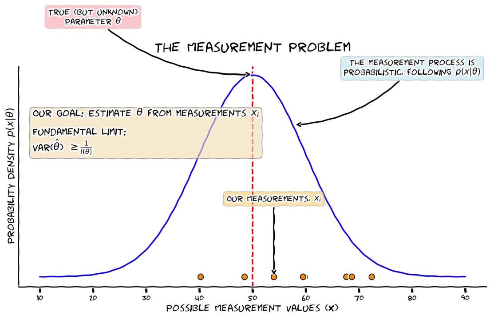

# A Visual Introduction to Fisher Information

This repository contains the Python code used to generate the plots for the YouTube tutorial "A Visual Introduction to Fisher Information and the Cramér-Rao Lower Bound."

The script uses `matplotlib` in `xkcd` mode to create an intuitive, step-by-step visual explanation of core statistical concepts, including Maximum Likelihood Estimation (MLE), the Cramér-Rao Lower Bound (CRLB), and the Fisher Information Matrix (FIM).

---

## ✨ Overview

This image provides a glimpse of the visual style and concepts covered in the tutorial.

<p align="center">
  
</p>

---

## 📺 Tutorial Video

You can watch the full tutorial presentation that these plots were created for on YouTube:

[**A Visual Introduction to Fisher Information and the Cramér-Rao Lower Bound**](https://youtu.be/-5UwzDGaahk)

---

## 🚀 Usage

Simply run the script `Fisher_visualizations.py`

### Prerequisites

You will need Python 3 and the following libraries installed:
* `numpy`
* `matplotlib`
* `scipy`

You can install these dependencies using pip:
```bash
pip install numpy matplotlib scipy
